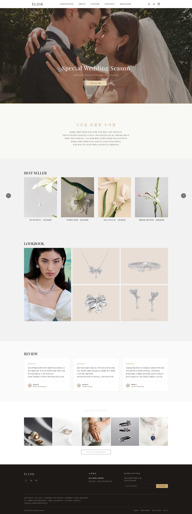
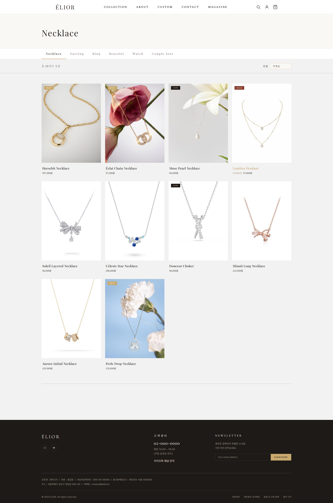
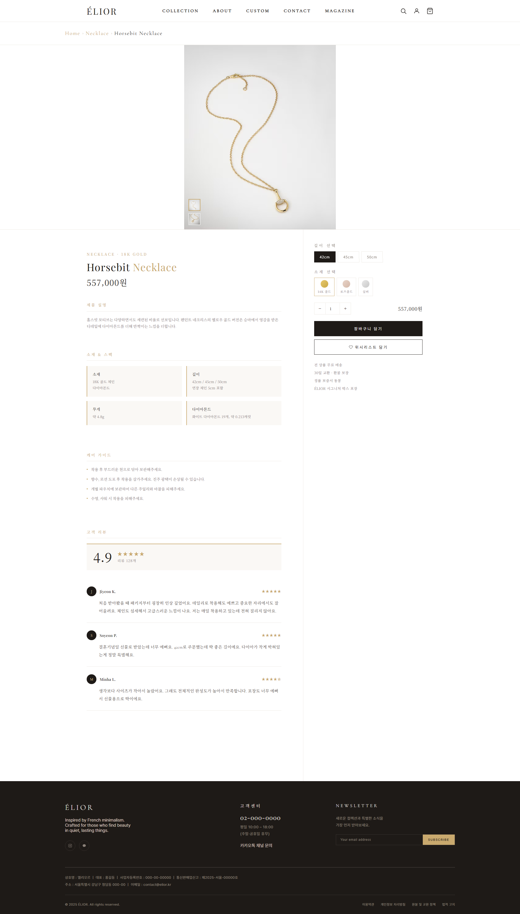

# ÉLIOR — Luxury Jewelry Brand Website

> 프렌치 미니멀리즘에서 영감을 받은 럭셔리 주얼리 브랜드의 풀 페이지 이커머스 웹사이트

<br>

## Live Site
(https://8wjdwlsk.github.io/elior-jewelry)

<br>

##  Preview

| 메인 페이지 | 컬렉션 | 상세 페이지 |
|---|---|---|
|  |  |  |

<br>

## 프로젝트 구조
```
elior-jewelry/
├── index.html              # 메인 페이지
├── collection.html         # 컬렉션
├── product_detail.html     # 상품 상세
├── cart.html               # 장바구니
├── mypage.html             # 마이페이지
├── about.html              # 어바웃
├── custom.html             # 커스텀
├── contact.html            # 컨택트
├── magazine.html           # 매거진
├── css/
│   ├── ÉLIOR.css           # 공통 스타일
│   ├── collection.css
│   ├── custom.css
│   └── ...
├── js/
│   └── products.js         # 상품 데이터
└── img/
```

<br>

## 기술 스택


외부 라이브러리 없이 **순수 HTML / CSS / Vanilla JS** 만으로 구현했습니다.

<br>

##  페이지 구성

| 페이지 | 주요 기능 |
|---|---|
| **메인** | 2장 자동 슬라이드, 헤더 스크롤 감지, 베스트셀러 슬라이더, 룩북 그리드 |
| **컬렉션** | 카테고리별 URL 파라미터 전환, 상품 동적 렌더링, 위시리스트, 페이지네이션 |
| **상품 상세** | 이미지 갤러리, 옵션 선택, 수량 조절, 장바구니·위시리스트 localStorage 연동 |
| **장바구니** | 체크박스 선택, 수량 조절, 쿠폰 적용, 배송지 선택, 실시간 가격 계산 |
| **마이페이지** | 위시리스트 localStorage 연동, 주문 내역, 쿠폰·포인트, 배송지·리뷰 관리 |
| **About** | Brand Story · 장인정신 · 아틀리에 탭, 풀윗 비주얼 섹션 |
| **Custom** | 진행 방식 · 요청서 · 옵션 · 사이즈 가이드 · 작업 사례 탭 |
| **Contact** | 상품 문의 폼, 아코디언 FAQ, 방문 예약 폼 |
| **Magazine** | 카테고리 필터, 카드 그리드 |

<br>

##  주요 구현 포인트

- **상품 데이터 분리** — `products.js`로 데이터와 UI를 분리해 유지보수성 향상
- **localStorage 연동** — 위시리스트·장바구니가 페이지 이동 후에도 유지
- **IntersectionObserver** — 헤더 스크롤 감지로 sticky 효과 구현
- **반응형 디자인** — PC(1440px) / 태블릿(1024px) / 모바일(430px) 3단계 대응
- **햄버거 메뉴** — 모바일에서 GNB를 풀스크린 오버레이로 전환
- **한영 혼용 타이포그래피** — Playfair Display + Noto Serif KR 조합으로 자연스러운 혼용

<br>

## 디자인 시스템

| 항목 | 값 |
|---|---|
| **Primary Color** | `#C9A96E` (골드) |
| **Dark Color** | `#1E1A17` (다크 브라운) |
| **Background** | `#FAF8F5` (크림) |
| **영문 폰트** | Playfair Display, Cormorant Garamond |
| **한글 폰트** | Noto Serif KR, Noto Sans KR |

<br>

## 반응형 지원

| 디바이스 | 해상도 |
|---|---|
| Desktop | 1440px~ |
| Tablet | ~1024px |
| Mobile | ~430px |

<br>

## 🗓️ 개발 기간

2026.03 — 2026.04

<br>

---

<p align="center">
  Designed & Developed by <strong>정지나</strong>
</p>
